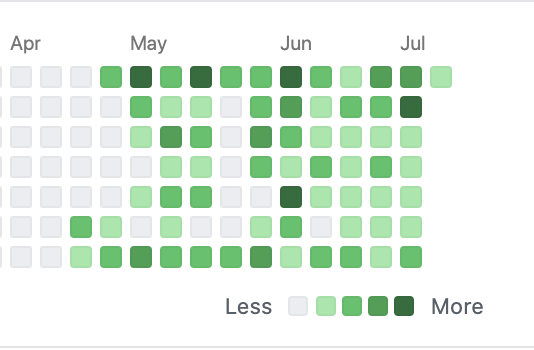

### Hello :wave:
**Hope you are doing great!!** :computer:   I'm **[Prateek Gupta](https://www.linkedin.com/in/prateek-gupta-6057a2a3/)** :man: :virgo:, Kickstarted my journey :running_man: as a **Software Engineer** one and a half years back. Till date founding myself attracted towards learning new technologies and knowing big tech companies :office: architectures. 
Currently, actively contributing to my **[Github](https://github.com/Prat9501?tab=repositories)** and looking forward to contribute :open_hands: in open source projects. Utilizing this **lockdown** :lock: building and acquiring new skills. 

---

---

### :gear: My Skillset:

- **Languages**: `Python`, `JavaScript`
- **Frontend**: `React`, `HTML`, `CSS`
- **Backend**: `Django`, `Node.js`, `Express`
- **Databases**: `MySQL`, `MongoDB`, `Postgres`
- **Testing frameworks**: `Selenium`, `Cypress`

A strong believer in **Karma** and never looses **Hope** :innocent:, loves **Cricket** and fond of **Electro Music** :notes:.

<h1 align="center">Connect me with :hand: (mailto:prateekg.9501@gmail.com)  Projects by 
  </h1>
